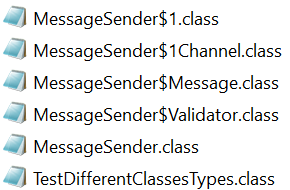

# Message Sender 
### _(inner, nested, anonymous, local classes usage)_

#### To start using script (_[see README](https://github.com/YULIYA2001/LeverXCource/tree/homework1-main/Homework1-Subclasses/README.md)_).
### To start the program manually:

**1.** <sup>_In terminal_</sup> Compile program:
```
    javac -cp <created_directory_path>/lib/logger_lib.jar -d <output_directory_path> <created_directory_path>/Subtask2/src/com/subtask2/*.java
```

**2.** <sup>_In terminal_</sup> Run program:

To run on __Windows__:
```
java -cp <output_directory_path>;<created_directory_path>\lib\logger_lib.jar com.subtask2.TestDifferentClassesTypes
```

To run on __Linux__:
```
java -cp <output_directory_path>:<created_directory_path>/lib/logger_lib.jar com.subtask2.TestDifferentClassesTypes
``` 

**3.** <sup>_In terminal_</sup> To create executable JAR file (including test) run:
   ```
    # Create manifest (entry point)
    echo Main-Class: com.subtask2.TestDifferentClassesTypes > <created_directory_path>/Subtask2/manifest.txt
    echo Class-Path: ../lib/logger_lib.jar >> <created_directory_path>/Subtask2/manifest.txt
    
    # Build JAR-file
    jar cfm <created_directory_path>/Subtask2/message_sender.jar <created_directory_path>/Subtask2/manifest.txt -C <output_directory_path> .
    
    # Run JAR-file
    java -jar <created_directory_path>/Subtask2/message_sender.jar
   ```

## After compile: 
**_Separate .class file for each inner/nested/anonymous/local class_**


