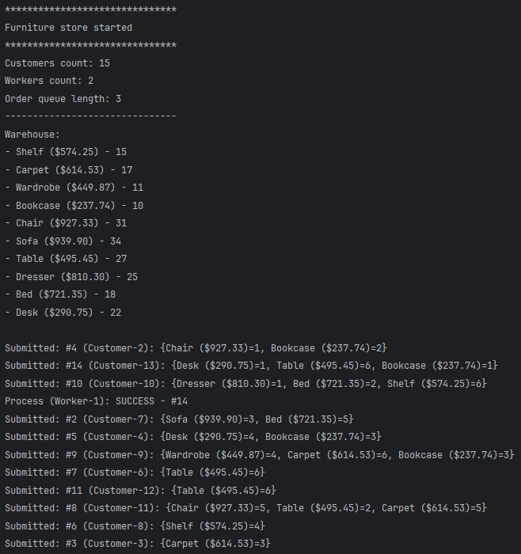
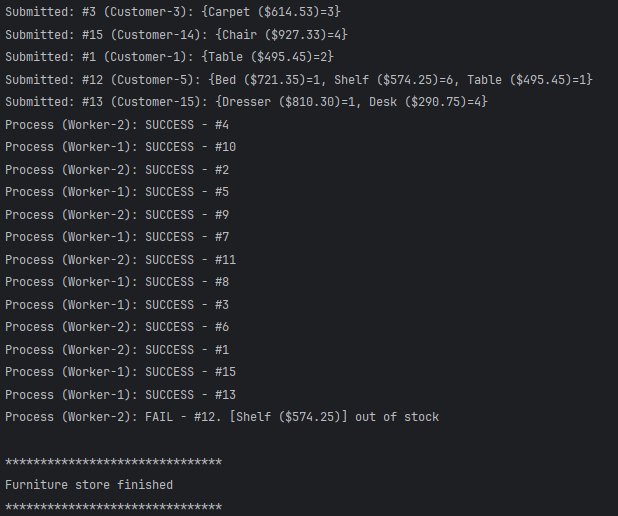
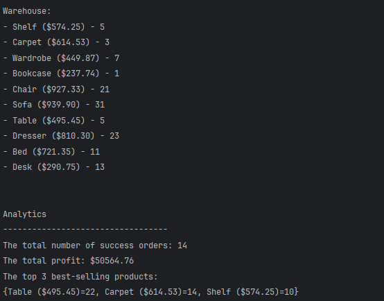

# Furniture store

### Requirements:
There is a product catalog — a list of objects with price and quantity in stock.
Several customers create orders at the same time using multithreading (Runnable or ExecutorService).
The warehouse is a shared resource (ConcurrentHashMap<Product, Integer>).
Several warehouse workers process orders taken from a BlockingQueue<Order>.

After all orders are processed, run analytics in parallel (parallelStream) to show:
- the total number of orders;
- the total profit;
- the top 3 best-selling products.

### Program output example:

