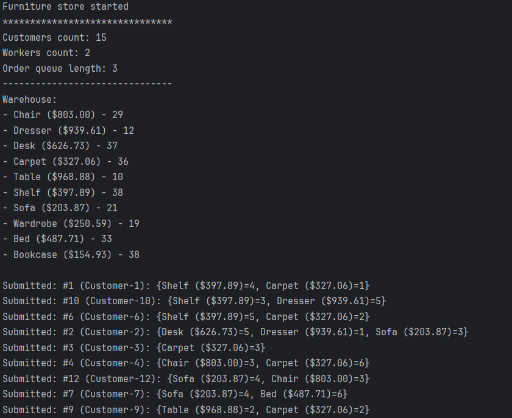
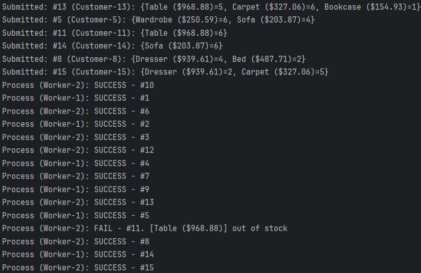
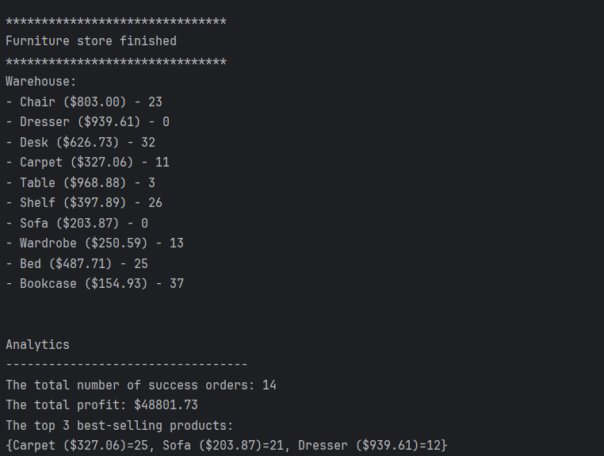

# (Spring Boot) Furniture store

### Requirements:
Homework is based on previous one ([Furniture store](https://github.com/YULIYA2001/LeverXCource/tree/homework2-3-reservation/Homework2_3)):

1. In the same repository, create a PR to implement a new feature - reservation functionality:
- Products can be reserved by a customer, but no order is created, and no one else can buy them.
- Product reservations can be deleted, making the products available to other customers again.

2. Create a new repository with Spring Boot and:
- Open the first PR without the reservation functionality and merge it into the main branch.
- Analytics should be done using AOP (create a custom aspect).
- Open the second PR with the reservation functionality.
- The second PR should also include analytics for a reservation functionality: the higher reserved
  quantity percentage for each product.

### Program output example:

